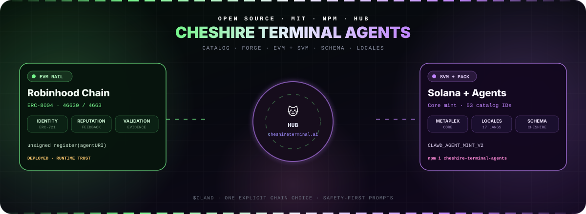

<p align="center">
  <a href="public/assets/cheshire-terminal-agents.svg">
    
  </a>
</p>

# Clawd Agents

**Catalog + forge. One package for agent prompts and on-chain identity.**  
Ship Clawd / Cheshire-schema agents, then register them on **Robinhood Chain** (EVM / ERC-8004), **Solana** (SVM / Metaplex Core), or *both rails* with optional LayerZero zk-omni through the Cheshire Terminal hub.

<p align="center">
  <a href="https://cheshireterminal.ai/agents"></a>
  <a href="https://cheshireterminal.ai/agents/forge"></a>
  <a href="https://www.npmjs.com/package/cheshire-terminal-agents"></a>
  <a href="LICENSE"></a>
</p>

<p align="center">
  
  
  
  
  
  
</p>

```
  ██████╗██╗      █████╗ ██╗    ██╗██████╗      █████╗  ██████╗ ███████╗███╗   ██╗████████╗███████╗
 ██╔════╝██║     ██╔══██╗██║    ██║██╔══██╗    ██╔══██╗██╔════╝ ██╔════╝████╗  ██║╚══██╔══╝██╔════╝
 ██║     ██║     ███████║██║ █╗ ██║██║  ██║    ███████║██║  ███╗█████╗  ██╔██╗ ██║   ██║   ███████╗
 ██║     ██║     ██╔══██║██║███╗██║██║  ██║    ██╔══██║██║   ██║██╔══╝  ██║╚██╗██║   ██║   ╚════██║
 ╚██████╗███████╗██║  ██║╚███╔███╔╝██████╔╝    ██║  ██║╚██████╔╝███████╗██║ ╚████║   ██║   ███████║
  ╚═════╝╚══════╝╚═╝  ╚═╝ ╚══╝╚══╝ ╚═════╝     ╚═╝  ╚═╝ ╚═════╝ ╚══════╝╚═╝  ╚═══╝   ╚═╝   ╚══════╝
                         ✦ dual-chain agent forge · cheshire-terminal-agents@1.48.3 ✦
```

**Clawd Agents** ships as [`cheshire-terminal-agents`](https://www.npmjs.com/package/cheshire-terminal-agents) on npm — the open catalog + forge package for:

1. **Agent catalog** — 138 dual-chain agent definitions, character personas, locales, and schema validation  
2. **Identity forge** — dual-rail registration (Robinhood Chain EVM + Solana SVM) with fail-closed safety  

Hosted surfaces: [agent hub](https://cheshireterminal.ai/agents) · [eliza studio](https://cheshireterminal.ai/eliza-agents) · [agent forge](https://cheshireterminal.ai/agents/forge) · [CLI hub](https://cheshireterminal.ai/cli) · [catalog API](https://cheshireterminal.ai/api/agents/catalog)

### Open-source companion repos

| Repo | Role | Site hub |
|------|------|----------|
| **[Solizardking/agents](https://github.com/Solizardking/agents)** (this package) | Agent catalog + forge scaffolds | [/agents](https://cheshireterminal.ai/agents) |
| **[Solizardking/cli](https://github.com/Solizardking/cli)** | Official site CLI (`cheshire-terminal-cli`) | [/cli](https://cheshireterminal.ai/cli) |
| **[Solizardking/eliza](https://github.com/Solizardking/eliza)** | elizaOS fork + `@elizaos/cheshire-eliza` | [/eliza-agents](https://cheshireterminal.ai/eliza-agents) |
| **[Solizardking/cheshire-terminal](https://github.com/Solizardking/cheshire-terminal)** | Main product app (server, client, API) | [cheshireterminal.ai](https://cheshireterminal.ai) |

```bash
# discover product hubs + all four GitHub sources from the CLI
npx cheshire-terminal-cli connect
npx cheshire-terminal-cli eliza:status
npx cheshire-terminal-cli agents:list
```

---

## ⎧ ONE-SHOT INSTALL ⎫

```bash
# zero config — open the design TUI (fork templates → customize → save)
npx cheshire-terminal-agents

# or explicit
npx cheshire-terminal-agents design

# install globally (bins: cheshire-terminal-agents · ct-agents)
npm i -g cheshire-terminal-agents
ct-agents design
ct-agents catalog
ct-agents serve

# add to any project
npm i cheshire-terminal-agents
```

Requires **Node.js `>=18.18`** (ESM).

### Design your own agent (TUI)

Every catalog agent, character, minted example, and blank scaffold is a **forkable template**. The design TUI walks you through:

1. **Pick a template** — catalog agent / character / scaffold / minted  
2. **Customize** — identifier, title, author, category, tags, systemRole  
3. **Validate** — against `schema/clawdAgentSchema.v1.json`  
4. **Save** — local JSON you own (default `./agents/<id>.json`)

```bash
# interactive forge
ct-agents design
ct-agents forge          # alias

# list everything you can fork
ct-agents design --list

# non-interactive fork
ct-agents design --from defi-yield-farmer --id my-yield-bot --out ./agents/my-yield-bot.json

# blank scaffold
ct-agents design --blank --id research-bot --title "Research Bot" --out ./research-bot.json

# oneshot forge + choose Skill Hub skills (refs only — no bloat)
ct-agents design --from blank --id forge-bot \
  --skills metaplex-agent,cheshire-core \
  --out ./forge-bot.json

# same, and download ONLY those skills into ./.agents/skills
ct-agents design --from blank --id forge-bot \
  --skills metaplex-agent,trading \
  --install-skills \
  --out ./forge-bot.json

# Skill Hub multi-select TUI / REPL (595 skills stay remote)
ct-agents skills              # interactive picker — toggle, then sparse-install
ct-agents skills pick         # same
ct-agents skills packs
ct-agents skills search vulcan
ct-agents skills install metaplex-agent          # sparse fetch of one skill
ct-agents skills attach ./forge-bot.json trading # add refs to existing agent

# Browser multi-select UI (after serve)
ct-agents serve
# open http://localhost:3000/skills-picker.html

# validate a definition
ct-agents design --validate ./agents/my-yield-bot.json
```

**Skills without install bloat:** the 595 Skill Hub playbooks live at
[Solizardking/skillhub-main](https://github.com/Solizardking/skillhub-main).
This package only ships a tiny `skills/skillhub-index.json` pointer + curated packs.
Full catalog is fetched on demand; installs pull **only** the slugs you select.

| Source | Path | Role |
|--------|------|------|
| Catalog agents | `agents/*.json` | Production prompts — fork & specialize |
| Scaffolds | `templates/*.template.json` | Blank / DeFi / security / trading starters |
| Characters | `characters/*.json` | Persona seeds converted to agent shells |
| Minted | `minted/*.json` | On-chain mint metadata → light agent shells |
| Schema | `schema/clawdAgentSchema.v1.json` | Validation contract |
| Locales | `locales/<id>/` | i18n packs for published agents |

### CLI

| Command | Effect |
|---------|--------|
| `ct-agents` / `ct-agents design` | **Design TUI** — fork templates, customize, validate, save |
| `ct-agents forge` | Alias for `design` |
| `ct-agents design --list` | List forkable templates (agents + scaffolds + characters) |
| `ct-agents design --from <id>` | Non-interactive fork |
| `ct-agents design --validate <file>` | Schema-check an agent JSON |
| `ct-agents catalog` | Print catalog stats (agents, one-shots, featured, categories, hub) |
| `ct-agents templates` | List scaffold templates from the catalog |
| `ct-agents skills` / `skills pick` | **Multi-select TUI** — browse catalog, toggle skills, sparse-install only picks |
| `ct-agents skills packs` | Curated packs (cheshire-core, trading, imperial, …) |
| `ct-agents skills search <q>` | Search Skill Hub |
| `ct-agents skills install <slug>` | Sparse-fetch one skill into `./.agents/skills` |
| `ct-agents serve` → `/skills-picker.html` | Browser multi-select UI (copy install cmd / refs JSON) |
| `ct-agents dna list` | List `characters/*.json` seeds for DNA generation |
| `ct-agents dna generate --from <id> --out <dir>` | Write IDENTITY/SOUL/USER/TOOLS bundle |
| `ct-agents knowledge list` | List package corpus under `knowledge/` |
| `ct-agents knowledge init --from clawd --out <dir>` | Scaffold a personal knowledge folder |
| `ct-agents knowledge upload <files> --out <dir>` | Add notes/docs into a knowledge folder |
| `ct-agents knowledge inject <dir>` | Write `.grok/rules/knowledge-inject.md` |
| `ct-agents knowledge eliza-docs` | Prepare corpus as elizaOS `docs/` for RAG |
| `ct-agents registry` | Print on-chain registry index |
| `ct-agents schema` | Show `clawdAgentSchema` info |
| `ct-agents serve [--port]` | Local static API from `public/` |
| `ct-agents --help` | Usage + live endpoint map |

```bash
npx cheshire-terminal-agents design --list
npx cheshire-terminal-agents catalog
npx cheshire-terminal-agents skills packs
npx cheshire-terminal-agents dna list
npx cheshire-terminal-agents knowledge list
npx cheshire-terminal-agents serve --port 8080
```

---

## ⎧ WHAT YOU GET ⎫

| Surface | Included | Boundary |
|---------|----------|----------|
| **Agent catalog** | 138 agents in `agents-catalog.json`, 54 JSON defs under `agents/`, 10 characters, locales, schema | Prompts + metadata — not a custody runtime |
| **CLI** | `cheshire-terminal-agents` · `ct-agents` → `bin/ct-agents.js` | No silent wallet broadcast |
| **Skills** | 11 suite skills under `skills/` (31 `SKILL.md` incl. nested `rh-crypto-agent` pack) | Instruction content — pin like code |
| **DNA** | Continuity templates + `ct-agents dna` generator (`dna/`) | Session identity — not runtime custody |
| **Knowledge** | Injectable corpus + `ct-agents knowledge` CLI (`knowledge/`) | Memory/RAG content — not a vector DB host |
| **Eliza surfaces** | `eliza-agents/` catalog + nested `eliza/` fork checkout | Studio hub at [/eliza-agents](https://cheshireterminal.ai/eliza-agents) |
| **Robinhood rails** | `robinhood-schema/`, `robinhood-src/`, forge skills | Unsigned intents — wallet signs elsewhere |
| **ZK primitives** | `zk-primitives/` nullifier + compressed-state package | Circuit-gated proofs — separate from catalog prompts |
| **REST / discovery** | `public/api/agents/*`, `.well-known/acp.json`, `ai-plugin.json` | Hosted hub is source of truth for live chain config |
| **Nested packages** | Source under `packages/*` (TUI, headless, LZ, trust) | **Private / unpublished** — not on npm |
| **Optional companion** | [`clawdbot-go`](https://www.npmjs.com/package/clawdbot-go) Zero Clawd runtime | Separate package — not a hard dependency |

```
catalog prompts ──► agents-catalog.json ──► hub / MCP / chat
metadata + image ──► choose rails
  ├─ Robinhood Chain (4663)  → ERC-8004 identity
  ├─ Solana mainnet          → Metaplex Core + Agent Identity
  └─ both + zk-omni          → dual_identity_link (LayerZero)
```

---

## ⎧ LIVE ENDPOINTS ⎫

```
 AGENT HUB        https://cheshireterminal.ai/agents
 ELIZA STUDIO     https://cheshireterminal.ai/eliza-agents
 AGENT FORGE      https://cheshireterminal.ai/agents/forge
 CLI HUB          https://cheshireterminal.ai/cli
 CATALOG API      GET /api/agents/catalog          →  138 agents · 2 one-shots · 6 featured
 REGISTRY         GET /api/agents/registry          →  on-chain docs
 TEMPLATES        GET /api/agents/templates          →  5 scaffolds
 ACP DISCOVERY    GET /.well-known/acp.json         →  protocol
 AI PLUGIN        GET /.well-known/ai-plugin.json   →  chat-gpt
 ASSETS           /assets/*.svg                     →  forge art
```

```bash
curl -fsS https://cheshireterminal.ai/api/agents/catalog | jq '.stats'
# local mirrors after: ct-agents serve --port 8080
curl -fsS http://localhost:8080/api/agents/catalog | jq '.stats'
```

Package-local surfaces (CLI, not HTTP):

| Surface | Command | Path |
|---------|---------|------|
| Catalog stats | `ct-agents catalog` | `agents-catalog.json` |
| DNA templates | `ct-agents dna …` | `dna/`, `characters/` |
| Knowledge corpus | `ct-agents knowledge …` | `knowledge/` |
| Suite skills | `ct-agents skills packs` | `skills/` + `skills/suite-index.json` |
| Eliza catalog | (studio hub) | `eliza-agents/catalog.json` |
| ZK primitives | (package) | `zk-primitives/` |
| Robinhood schema/src | (library) | `robinhood-schema/`, `robinhood-src/` |
| OSS hub map | — | `open-source-connection-map.json` |

---

## ⎧ CATALOG STATS ⎫

Facts from `agents-catalog.json` (rebuild with `npm run build`):

| Metric | Count |
|--------|------:|
| **Agents** | **138** |
| One-shots | 2 |
| Featured | 6 |
| Templates | 5 |
| Categories | 16 |
| Character profiles (`characters/`) | 10 |
| Agent JSON defs (`agents/`) | 54 |
| Suite skills (`skills/suite-index.json`) | 11 |
| Skill docs (`SKILL.md`, incl. nested pack) | 31 |
| Locale files | ~759 |

### Category breakdown

| Category | Agents |
|----------|-------:|
| defi | 62 |
| payments | 25 |
| trading | 15 |
| character | 6 |
| security | 6 |
| infrastructure | 5 |
| platform | 3 |
| dev-tools | 3 |
| crypto | 3 |
| voice-council | 2 |
| nft | 2 |
| education | 2 |
| tools | 1 |
| programming | 1 |
| research | 1 |
| governance | 1 |

### Featured agents

| Agent | Category | Type |
|-------|----------|------|
| **Clawd Perps Runtime** | `trading` | featured |
| **CLAWD LiveKit Voice** | `platform` | featured |
| **Mechaplex · Mech Builder** | `platform` | featured |
| **Solana PumpFun/PumpSwap Copy Trading Bot** | `trading` | one-shot · featured |
| **Vulcan CLAWD Autonomous Perps** | `trading` | featured |
| **Clawd** (Imperial perps) | `trading` | one-shot · featured |

---

## ⎧ NPM SURFACE ⎫

| Package | npm | Status |
|---------|-----|--------|
| **Clawd Agents / forge** | [`cheshire-terminal-agents@1.48.3`](https://www.npmjs.com/package/cheshire-terminal-agents) | **Published** · bins `cheshire-terminal-agents`, `ct-agents` |
| Zero Clawd runtime | [`clawdbot-go`](https://www.npmjs.com/package/clawdbot-go) | Optional companion |
| `@cheshire/clawd-agent-tui` | — | **Private** (source only in `packages/clawd-agent-tui`) |
| `@cheshire/headless-agent` | — | **Private** (source only in `packages/headless-agent`) |
| `@cheshire/layerzero-omnichain` | — | **Private** |
| `@cheshire/solana-agent-trust` | — | **Private** |

```bash
# published package only
npm view cheshire-terminal-agents name version bin
# name = cheshire-terminal-agents
# version = 1.48.3
# bin.cheshire-terminal-agents = bin/ct-agents.js
# bin.ct-agents = bin/ct-agents.js
```

---

## ⎧ REPO TOPOLOGY ⎫

```
clawd-agents / cheshire-terminal-agents
├── agents/              # 54 agent definition JSON files
├── agents-catalog.json  # built catalog (138 agents · 2 one-shots · 6 featured)
├── bin/ct-agents.js     # CLI entry (npm bins)
├── characters/          # 10 character profiles (+ package.json)
├── dna/                 # agentic DNA continuity templates
├── docs/                # package docs (API, deploy, guides)
├── eliza/               # nested Solizardking/eliza fork checkout
├── eliza-agents/        # eliza studio surface + catalog.json
├── examples/            # robinhood + solana templates
├── knowledge/           # injectable knowledge corpus (JSONL + md)
├── locales/             # i18n overlays (~759 files)
├── packages/            # private nested packages (not published)
│   ├── clawd-agent-tui/
│   ├── headless-agent/
│   ├── layerzero-omnichain/
│   └── solana-agent-trust/
├── public/
│   ├── .well-known/     # acp.json · ai-plugin.json
│   ├── api/agents/      # catalog · registry · templates
│   └── assets/          # animated SVG banners
├── robinhood-schema/    # Cheshire agent schema (Robinhood Chain)
├── robinhood-src/       # catalog loaders, design TUI, DNA/knowledge CLI
├── schema/              # clawdAgentSchema
├── scripts/             # build + validate
├── skills/              # 11 suite skills (31 SKILL.md w/ nested pack)
├── zk-primitives/       # ZK nullifier + compressed-state package
├── open-source-connection-map.json  # product hubs ↔ GitHub repos
└── package.json         # name: cheshire-terminal-agents @ 1.48.3
```

Primary product hubs (see `open-source-connection-map.json`):

| Hub | URL |
|-----|-----|
| Agents | https://cheshireterminal.ai/agents |
| Eliza agents | https://cheshireterminal.ai/eliza-agents |
| CLI | https://cheshireterminal.ai/cli |
| Agent forge | https://cheshireterminal.ai/agents/forge |

---

## ⎧ QUICK START ⎫

```bash
# 1. Install
npm i -g cheshire-terminal-agents

# 2. Catalog (138 agents · 2 one-shots · 6 featured)
ct-agents catalog

# 3. Skills — remote Skill Hub + local Robinhood suite (11 top-level)
ct-agents skills packs
ct-agents skills search vulcan

# 4. Design / forge an agent from a catalog template
ct-agents design --list
ct-agents design --from clawd-imperial-perps --id my-perps --out ./agents/my-perps.json

# 5. Agentic DNA from character seeds
ct-agents dna list
ct-agents dna generate --from clawd --out ./my-clawd-dna

# 6. Knowledge corpus (package + your uploads)
ct-agents knowledge list
ct-agents knowledge init --from clawd --out ./my-knowledge
ct-agents knowledge upload ./notes.md --out ./my-knowledge

# 7. Schema + local API
ct-agents schema
ct-agents serve --port 8080
```

From any project (after `npm i cheshire-terminal-agents`):

```js
import catalog from 'cheshire-terminal-agents/catalog'
// or load agents-catalog.json via package exports
console.log(catalog.stats) // totalAgents, totalOneShots, totalFeatured, …
```

**Related package surfaces**

| Path | Role |
|------|------|
| `eliza-agents/` | Eliza studio catalog + characters → [cheshireterminal.ai/eliza-agents](https://cheshireterminal.ai/eliza-agents) |
| `eliza/` | Nested Solizardking/eliza fork checkout |
| `dna/` | Blank IDENTITY/SOUL/USER/TOOLS templates |
| `knowledge/` | Injectable JSONL + markdown swarm memory |
| `skills/` | Cheshire Robinhood skill suite (`suite-index.json`) |
| `zk-primitives/` | Nullifier + compressed-state ZK package |
| `robinhood-schema/` · `robinhood-src/` | RH agent schema + CLI loaders (design/DNA/knowledge) |
| `characters/` | 10 persona seeds for design + DNA |

Root agent scaffolds: `agent-template.json` · `agent-template-full.json` · `agent-template-attested.json`.

---

## ⎧ DEPLOYMENT PATHS ⎫

```
┌─── PR into repo ──────────────────────────────────────────────┐
│  static agent prompt · auto-cdn · locales                     │
└───────────────────────────────────────────────────────────────┘
┌─── Self-host + A2A ───────────────────────────────────────────┐
│  custom logic · streaming · discoverable via hub              │
└───────────────────────────────────────────────────────────────┘
┌─── Mint as MPL Core ──────────────────────────────────────────┐
│  on-chain identity · solana:mainnet · transferable ownership  │
└───────────────────────────────────────────────────────────────┘
┌─── MCP server only ───────────────────────────────────────────┐
│  tool provider · clawd desktop · cursor                       │
└───────────────────────────────────────────────────────────────┘
```

---

## ⎧ SECURITY MODEL ⎫

- Never request, store, print, or transmit private keys or seed phrases.
- Hosted forge APIs prepare unsigned intents — they do not custody wallets.
- Re-fetch live registry / health endpoints before any chain write.
- Catalog prompts are instruction content — not automatic execution.
- Agent identity assets are not investment promises.

---

## ⎧ DEVELOP & VERIFY ⎫

```bash
npm run build      # rebuild agents-catalog.json + validate
npm run validate   # schema / catalog checks
npm test           # catalog + smoke-readme + dna + knowledge + eliza/zk paths + OSS map
npm run catalog    # print compact stats JSON
npm run test:dna
npm run test:knowledge
npm run test:eliza-zk
npm run verify:oss
node bin/ct-agents.js catalog
node bin/ct-agents.js dna list
node bin/ct-agents.js knowledge list
node bin/ct-agents.js skills packs --json
node bin/ct-agents.js --help
```

Smoke script (README + package + CLI consistency):

```bash
node scripts/smoke-readme-npm.cjs
```

---

## ⎧ VERSION ⎫

| Field | Value |
|-------|-------|
| Product | **Clawd Agents** |
| npm name | `cheshire-terminal-agents` |
| Version | **1.48.3** |
| Bins | `cheshire-terminal-agents`, `ct-agents` |
| License | MIT |
| Hub | https://cheshireterminal.ai/agents |

```
        ▄▄▄▄▄▄▄▄▄▄▄▄▄▄▄▄▄▄▄▄▄▄▄▄▄▄▄▄▄▄▄▄▄▄▄▄▄▄▄▄▄▄▄▄▄
       ██                                          ██
       ██  CLAWD AGENTS                            ██
       ██  cheshire-terminal-agents@1.48.3         ██
       ██  138 agents · 2 one-shots · 6 featured   ██
       ██  cheshireterminal.ai/agents              ██
       ██                                          ██
        ▀▀▀▀▀▀▀▀▀▀▀▀▀▀▀▀▀▀▀▀▀▀▀▀▀▀▀▀▀▀▀▀▀▀▀▀▀▀▀▀▀▀▀▀▀
```

## License

[MIT](LICENSE) © Cheshire Terminal / Clawd Agents contributors.
