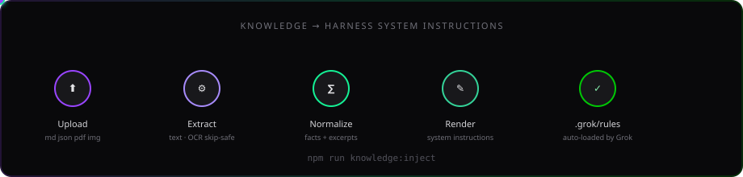

<!-- ╔══════════════════════════════════════════════════════════════════════════╗ -->
<!-- ║   OpenClawd Knowledge Base  ·  internal agent memory + inject pipeline  ║ -->
<!-- ╚══════════════════════════════════════════════════════════════════════════╝ -->

<p align="center">
  
</p>

<p align="center">
  
  
  
  
  
  
</p>

<div align="center">

# 🧠 OpenClawd Knowledge Base

### *Curated swarm memory — anti-patterns · decisions · facts · gotchas · patterns — one-shot inject into harness system instructions*

**Corpus:** this directory ·
**Inject:** [`npm run knowledge:inject`](../package.json) ·
**Upload your own:** [`ct-agents knowledge init|upload|inject`](../robinhood-src/knowledgeUpload.js) ·
**Rules out:** [`.grok/rules/knowledge-inject.md`](../.grok/rules/knowledge-inject.md) ·
**Pipeline:** [`scripts/knowledge-inject.mjs`](../scripts/knowledge-inject.mjs) ·
**Character template:** [`clawd-character.md`](./clawd-character.md) ·
**Tests:** `npm run test:knowledge-inject`

</div>

<p align="center">
  
</p>

---

## ✨ What lives here

This directory holds curated learnings from the agent swarm. Knowledge is extracted from:

- CodeRabbit PR reviews
- Human code reviews
- Agent discoveries during implementation
- Production incidents and debugging
- External documentation

### Provenance and link policy

The JSONL files are current machine-readable project memory. Local references in
this README and in current-project documentation must resolve inside this
repository.

The following narrative files are preserved upstream provenance snapshots:
`SOVEREIGN_RESEARCH.md`, `clawd-code-cli.md`, `clawd-tui.md`,
`clawdrouter.md`, `openclawd.md`, and `wiki.md`. Their relative links describe
the source repository layouts at the time they were captured; they are not
ClawdBrowser-local paths. Do not silently reinterpret those links as files in
this repository. A future refresh must record an authoritative upstream base
for each snapshot before rewriting its links.

## Directory Structure

```text
knowledge/
  README.md                    # This file (index + agent query guide)
  knowledge-banner.svg         # Animated hero (GitHub README)
  knowledge-inject-flow.svg    # Animated inject pipeline
  facts.jsonl                  # 15 entries · General domain facts (CLI, auth, registry, clawd_bot, tokenomics)
  codebase-facts.jsonl        # 13 entries · How the code works under the hood
  api-behaviors.jsonl         # 13 entries · External API quirks, rate limits, OpenRouter free router
  patterns.jsonl              # 13 entries · Reusable patterns and best practices
  anti-patterns.jsonl         # 13 entries · Things to avoid (secrets, free-chat billing, installer)
  gotchas.jsonl               # 12 entries · Common pitfalls and surprises
  decisions.jsonl             # 10 entries · Architectural decisions with context
  ── Markdown reference docs ──
  architecture-pieces.md      # How the core framework pieces fit together
  clawd-bot.md                # CLAWD Bot portable companion + OpenRouter free path
  clawd-character.md          # Clawd personality + lore + observable facts
  clawd-code-cli.md           # @openclawdsolana/clawd-code-cli v0.2.3 reference
  clawd-tui.md                # @openclawdsolana/clawd-tui v0.2.1 reference
  clawdrouter.md              # ClawdRouter LLM proxy architecture
  openclawd-hermes-memory.md  # Hermes memory model (OODA + tiers)
  openclawd.md                # Full OpenClawd v0.3.1 release notes
  SOVEREIGN_RESEARCH.md       # Sovereign research methodology
  wiki.md                     # AutoResearch Wiki architecture + agent queries
```

## Knowledge Fact Format

Each JSONL file contains one fact per line:

```json
{
  "id": "fact-abc123",
  "type": "api_behavior|architecture|code_quirk|decision|gotcha|integration|pattern",
  "fact": "Clear description of the knowledge",
  "recommendation": "What to do about it",
  "confidence": "high|medium|low",
  "provenance": [
    {
      "source": "coderabbit|human|agent|documentation|test|production",
      "reference": "PR #123",
      "date": "2026-01-09"
    }
  ],
  "tags": ["api", "rate-limiting"],
  "affectedFiles": ["src/lib/services/example.ts"],
  "affectedServices": ["ExampleService"],
  "createdAt": "2026-01-09T12:00:00Z",
  "updatedAt": "2026-01-09T12:00:00Z",
  "usageCount": 0,
  "helpfulCount": 0,
  "outdatedReports": 0
}
```

## Knowledge Types

| Type           | Description                       | Example                                        |
| -------------- | --------------------------------- | ---------------------------------------------- |
| `api_behavior` | How external APIs actually behave | "API returns 429 after ~100 req/min"           |
| `architecture` | Structural facts and boundaries   | "The gateway is a separate service"           |
| `code_quirk`   | Unexpected behavior in our code   | "Thread model stores drafts only, not threads" |
| `pattern`      | Reusable approach                 | "Use exponential backoff for rate limits"      |
| `gotcha`       | Common mistake                    | "Don't forget userId filter on queries"        |
| `decision`     | Why we chose X over Y             | "Chose Zustand over Redux for simplicity"      |
| `integration`  | Cross-system behavior             | "The adapter normalizes upstream payloads"     |

## Confidence Levels

| Level    | Meaning                  | When to Use                   |
| -------- | ------------------------ | ----------------------------- |
| `high`   | Verified multiple times  | CodeRabbit + human confirmed  |
| `medium` | Observed once reliably   | Single source, clear evidence |
| `low`    | Suspected but unverified | Inference, needs confirmation |

## 📤 Upload your own knowledge folder

Scaffold a personal pack modeled on **`clawd-character.md`** (Lore · Voice · Style Rules · Agent Knowledge Summary), then drop your files:

```bash
# 1) Init from Clawd (or any characters/*.json seed)
npx cheshire-terminal-agents knowledge init --from clawd --out ./my-knowledge

# 2) Upload your notes / dumps / jsonl
npx cheshire-terminal-agents knowledge upload ./notes.md ./research/ --out ./my-knowledge

# 3) Validate shape + inject into harness rules
npx cheshire-terminal-agents knowledge validate ./my-knowledge
npx cheshire-terminal-agents knowledge inject ./my-knowledge
```

Also: `npm run knowledge` → same CLI. Package corpus files in this directory remain the default inject source when you run inject with no args.

## ⚡ One-shot inject (harness system instructions)

Drop knowledge files (`.md`, `.txt`, `.json`, `.jsonl`, `.pdf`, images) into
`knowledge/` or pass extra paths, then run:

```bash
# Default: inject everything under knowledge/
npm run knowledge:inject
# or
node scripts/knowledge-inject.mjs
# or
npx cheshire-terminal-agents knowledge inject

# Extra uploads + default corpus
node scripts/knowledge-inject.mjs knowledge/ path/to/upload.pdf notes.txt

# Dry run (no write)
node scripts/knowledge-inject.mjs --dry-run
```

This writes harness-loaded project rules (no copy-paste):

| Path | Role |
| ---- | ---- |
| `.grok/rules/knowledge-inject.md` | Auto-loaded by Grok Build as system instructions / project rules |
| `.grok/knowledge-inject.manifest.json` | Machine report (sources, skips, fact ids) |

### Supported formats

| Format | Behavior |
| ------ | -------- |
| `.md` / `.txt` | Full text (excerpts if large) |
| `.json` / `.jsonl` | Structured facts (`id`, `type`, `fact`, `recommendation`, …) |
| `.pdf` | `pdftotext` when available; else skip with a clear reason |
| images (`.png`, `.jpg`, …) | `tesseract` when available; else skip with a clear reason |
| unknown binary | Skip with reason — the run does not crash |

### Safety and idempotency

- Re-runs overwrite **only** the generated inject targets (idempotent refresh).
- Root `AGENTS.md` / Convex stubs are **never** clobbered.
- Empty or failed runs **refuse to write**: if no input files are discovered, or
  every file fails/skips extraction (`okCount === 0`), the script exits `1` and
  leaves any prior `.grok/rules/knowledge-inject.md` intact.
  Example: `node scripts/knowledge-inject.mjs /nonexistent/foo.pdf` does not
  wipe a good inject down to an empty stub.

### Verify

```bash
npm run test:knowledge-inject
# Confirm harness loads the inject path:
grok inspect   # should list .grok/rules/knowledge-inject.md under Project Instructions
```

## Usage by Agents

Agents receive the injected rules automatically in this harness. They can also
query knowledge files directly before starting work:

```bash
# Find relevant facts
grep -l "<keyword>" knowledge/*.jsonl

# Query specific file patterns
jq 'select(.affectedServices | contains(["ExampleService"]))' knowledge/api-behaviors.jsonl
```

## Contributing Knowledge

Knowledge is added by:

1. **Knowledge Curator Agent** - Automated extraction from PRs
2. **Human developers** - Manual additions
3. **Other agents** - Discoveries during work

To add knowledge manually:

```bash
# Append to appropriate file
echo '{"id": "...", ...}' >> knowledge/gotchas.jsonl
```

## Maintenance

- **Weekly**: Knowledge Curator reviews for staleness
- **On PR merge**: Extract learnings from CodeRabbit
- **On incident**: Add post-mortem learnings

---

## Agent Knowledge Summary

> Quick-lookup index for agents loading this knowledge base. This README is the entry point — read it first, then query the specific JSONL files and markdown docs relevant to your task.

### JSONL Files — Machine-Queryable Facts

| File | Entry Count | Primary Topics |
| ---- | ----------- | -------------- |
| `facts.jsonl` | 15 | CLI arch, CAAP auth, agent registry, trading, goals, ClawdRouter, **clawd_bot companion**, OpenRouter free forms, pay-kit, USDC/SAS, env vars |
| `anti-patterns.jsonl` | 13 | npm pipe-to-tail, bash SC2015, secrets in `NEXT_PUBLIC_*`, **free-chat paid model ids**, unbuilt @solana/mpp, public PR exposure, hardcoded RPC |
| `api-behaviors.jsonl` | 13 | mpp no-dist, x402 CORS, USDC micro-units, Solana RPC limits, ClawdRouter keys, CAAP discovery, Phoenix perps, **OpenRouter free SSE + Free Models Router** |
| `codebase-facts.jsonl` | 13 | Port 4402, pay-kit workspace, binary names, ClawdRouter vs x402.wtf, $CLAWD tiers, **clawd_bot free-model cascade**, production vs portable companion mounts |
| `decisions.jsonl` | 10 | CAAP/1.0, MPP+x402, pnpm workspaces, fee-payer mode, Fly.io ClawdRouter, Convex gateway, **two-tier free OpenRouter + holder Grok** |
| `gotchas.jsonl` | 12 | @solana/mpp no dist, FEE_PAYER_KEY format, Vite env timing, **OPENROUTER_FREE_MODEL_CLAWD wins over FREE_MODEL**, missing server/lib attribution |
| `patterns.jsonl` | 13 | Mppx 5-step, env backfill, CAAP client init, goal-driven trading, **free-model cascade**, **two-tier companion SSE** |

### Markdown Files — Narrative Context

| File | Description | Key cross-refs |
| ---- | ----------- | -------------- |
| `architecture-pieces.md` | How the core OpenClawd pieces fit together (leviathan, gateway, plugin-sdk, **clawd_bot**) | `codebase-facts.jsonl` cbfact-003, `cbfact-011`, `decisions.jsonl` decision-003 |
| `clawd-bot.md` | Portable CLAWD companion: OpenRouter free path, Grok holders, env cascade, mounts | `facts.jsonl` fact-clawdbot-*, `api-behaviors.jsonl` api-011/012, `decision-009` |
| `clawd-character.md` | Clawd's identity, voice, Three Laws, Mayhem Mode, CDP browser, companion tone | `codebase-facts.jsonl` cbfact-009, `openclawd-hermes-memory.md`, `clawd-bot.md` |
| `clawd-code-cli.md` | clawd-code-cli: multi-provider (Grok/OpenRouter/Ollama/OpenAI), Birdeye, DFlow, voice | `facts.jsonl` fact-cli-001, `codebase-facts.jsonl` cbfact-004 |
| `clawd-tui.md` | OpenClawd TUI: OpenRouter OAuth, Solana on-paste analysis, slash commands | `codebase-facts.jsonl` cbfact-006, `api-behaviors.jsonl` api-006 |
| `clawdrouter.md` | ClawdRouter: multi-protocol payment gateway (x402/MPP/AP2/A2A), Anchor vault, revenue split | `codebase-facts.jsonl` cbfact-006, `facts.jsonl` fact-cli-006, `decisions.jsonl` decision-006 |
| `openclawd-hermes-memory.md` | HERMES x402 mega-story: Leviathan, ClawdRouter, Clawd Memory SOTA architecture | `clawd-character.md`, `SOVEREIGN_RESEARCH.md`, `codebase-facts.jsonl` cbfact-007 |
| `openclawd.md` | Full OpenClawd readme: v0.3.1 attestation agent, Leviathan lifecycle, 66 skills | `codebase-facts.jsonl` cbfact-008, `facts.jsonl` fact-pay-004 |
| `SOVEREIGN_RESEARCH.md` | Karpathy loop on Solana: autoloop, research orchestrator, Birdeye+Helius data plane | `wiki.md`, `api-behaviors.jsonl` api-006, `patterns.jsonl` pattern-008 |
| `wiki.md` | AutoResearch Wiki: 49 lobster agents, $CLAWD-gated API, research endpoints, MCP integration | `SOVEREIGN_RESEARCH.md`, `codebase-facts.jsonl` cbfact-009, `clawd-bot.md` |

### Query patterns for agents

```bash
# Find all gotchas related to mpp
grep '"mpp"' knowledge/gotchas.jsonl | jq .fact

# Find all high-confidence patterns
grep '^{' knowledge/patterns.jsonl | jq 'select(.confidence=="high") | .id + ": " + .fact[:80]'

# Find entries affecting a specific file
grep '^{' knowledge/*.jsonl | jq 'select(.affectedFiles[]? | contains("pay.sh")) | .id + " [" + .type + "]"'

# Full-text search across all knowledge
grep -h '^{' knowledge/*.jsonl | jq 'select(.fact | contains("USDC")) | .id'

# CLAWD Bot / OpenRouter free companion facts
grep -h 'clawd-bot\|openrouter/free\|OPENROUTER_FREE' knowledge/*.jsonl | jq -r '.id + ": " + .fact[:100]'
```
